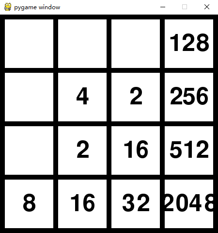

# 2048
基于python实现的2048
## 运行
```
python3 main.py
```
S键重新开始<br>
上下左右键上下左右移动<br>

## 实现
数据存放在一个二维数组中
### 右移动
```python
def move(self):
    flag = False
    for i in range(4):
        for j in range(3, 0, -1):
            for m in range(j - 1, -1, -1):
                if self.numbers[i][m]:
                    if not self.numbers[i][j]:
                        self.numbers[i][j] = self.numbers[i][m]
                        self.numbers[i][m] = 0
                        for n in range(m - 1, -1, -1):
                            if self.numbers[i][n]:
                                if self.numbers[i][j] == self.numbers[i][n]:
                                    self.numbers[i][j] *= 2
                                    self.numbers[i][n] = 0
                                break
                        flag = True
                    elif self.numbers[i][j] == self.numbers[i][m]:
                        self.numbers[i][j] *= 2
                        self.numbers[i][m] = 0
                        flag = True
                    break
    return flag
```
首先用双层循环遍历块，然后去遍历当前块的左边所有的块<br>
如果都是0块，不进行任何操作，直到下一个块的处理<br>
一旦找到非0块，如果和当前块相等，当前块翻倍，非0块置0即可<br>
如果当前块是0，首先交换两个块，然后还需去遍历非0块左边所有的块<br>
如果有相等的块，当前块还需要翻倍，第2个非0块也置零<br>
重要的地方在于每次找到非0块时，不管有没有处理，都要切断当前循环
### 其它方向移动
其它方向的移动只要对二维数组进行旋转或翻转，然后调用右移动函数即可<br>
首先定义一个交换块的函数
```python
def exchange_data(self, *args):
    for i in range(len(args) - 1):
        self.numbers[args[i][0]][args[i][1]], self.numbers[args[i + 1][0]][args[i + 1][1]] = \
            self.numbers[args[i + 1][0]][args[i + 1][1]], self.numbers[args[i][0]][args[i][1]]
```
左移动只需要翻转即可
```python
def left_move(self):
    for i in range(4):
        self.numbers[i] = self.numbers[i][::-1]
    flag = self.move()
    for i in range(4):
        self.numbers[i] = self.numbers[i][::-1]
    return flag
```
下移动先顺时针旋转，在逆时针旋转，上移动相反操作即可
```python
def down_move(self):
    for i in range(3):
        self.exchange_data([0, i], [i, 3], [3, 3 - i], [3 - i, 0])
    self.exchange_data([1, 1], [1, 2], [2, 2], [2, 1])
    flag = self.move()
    for i in range(3):
        self.exchange_data([0, i], [3 - i, 0], [3, 3 - i], [i, 3])
    self.exchange_data([1, 1], [2, 1], [2, 2], [1, 2])
    return flag

def up_move(self):
    for i in range(3):
        self.exchange_data([0, i], [3 - i, 0], [3, 3 - i], [i, 3])
    self.exchange_data([1, 1], [2, 1], [2, 2], [1, 2])
    flag = self.move()
    for i in range(3):
        self.exchange_data([0, i], [i, 3], [3, 3 - i], [3 - i, 0])
    self.exchange_data([1, 1], [1, 2], [2, 2], [2, 1])
    return flag
```